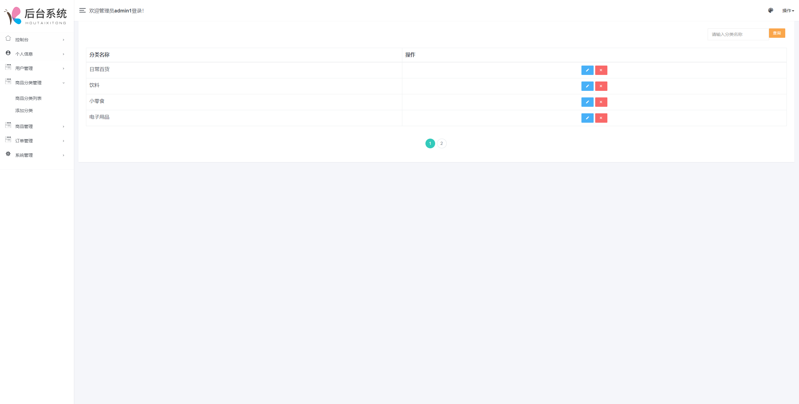

<h1 align="center">基于JSP+Servlet实现的网上商城系统</h1>

 获取sql文件 QQ: 3645296857 QQ群: 978300347 

<h4> 需要视频演示可联系上述QQ，私发视频链接 </h4>

 获取更多高质量源码，请访问：[mzoo源码网](https://mzoocodes.com/)

## 简介

> 本代码来源于网络,仅供学习参考使用!
>
> <b style="color: dodgerblue"> 提供1.远程部署/2.修改代码/3.定制程序/4.文档指导/5.框架代码讲解、技术解答、代码讲解等服务 </b>
>
> 管理员登录地址：http://localhost:8080/AdminServlet?action=toLogin
>
> 管理员: admin@qq.com 密码: 123456
>
> 用户地址：http://localhost:8080/
> 
> 用户：test@qq.com 密码: 123456

## 项目介绍

基于JSP+Servlet实现的网上商城系统：前端 JSP、BootStrap、JQuery、Ajax，后端 Servlet、JDBC，系统角色分为：管理员和用户。管理员在管理端对系统用户进行管理，可以对商品和订单进行管理，发布新商品等；用户可以购买商品，查看商品列表等。主要功能如下：

### 管理员

- 基本操作：登录、注册、修改个人信息、修改密码、登出
- 商品管理：管理员可以添加、修改、删除商品信息，包括商品的名称、价格、库存、描述等。
- 商品分类管理：管理员可以添加、修改、删除商品分类信息。
- 订单管理：管理员可以查看用户的订单信息，包括订单的状态、商品数量、总金额等，并可以进行订单的处理，如确认付款、发货、退款等。
- 用户管理：管理员可以查看用户的信息，包括用户名、联系方式、收货地址等，并可以对用户进行管理，如禁用用户、重置用户密码等。
- 数据统计：管理员可以查看商城的销售数据、用户活跃度等统计信息，帮助商城运营和决策。
- 网站设置：管理员可以对商城的基本设置进行调整，如网站名称、Logo、客服电话等。

### 用户

- 基本操作：登录、注册、修改个人信息、修改密码、登出
- 商品模块：用户可以浏览商城的商品，包括浏览商品分类、搜索商品、查看商品详情等。
- 购物车管理：用户可以将感兴趣的商品添加到购物车中，可以修改购物车的商品数量、删除商品等。
- 下订单：用户可以在选定商品后生成订单，包括选择商品规格、填写收货地址等。
- 在线支付：用户可以选择在线支付方式进行支付，如支付宝、微信支付等。
- 订单管理：用户可以查看自己的订单信息，包括订单状态、商品数量、总金额等，并可以进行一些操作，如取消订单、确认收货等。
- 评价商品：用户可以对购买的商品进行评价，并给出相应的评分和评论。

## 环境

- <b>IntelliJ IDEA 2020.3</b>

- <b>Mysql 5.7.26</b>

- <b>Tomcat 9.0.41</b>

- <b>JDK 1.8</b>

## 运行截图

